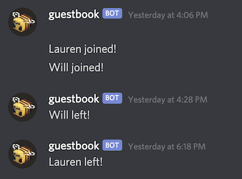
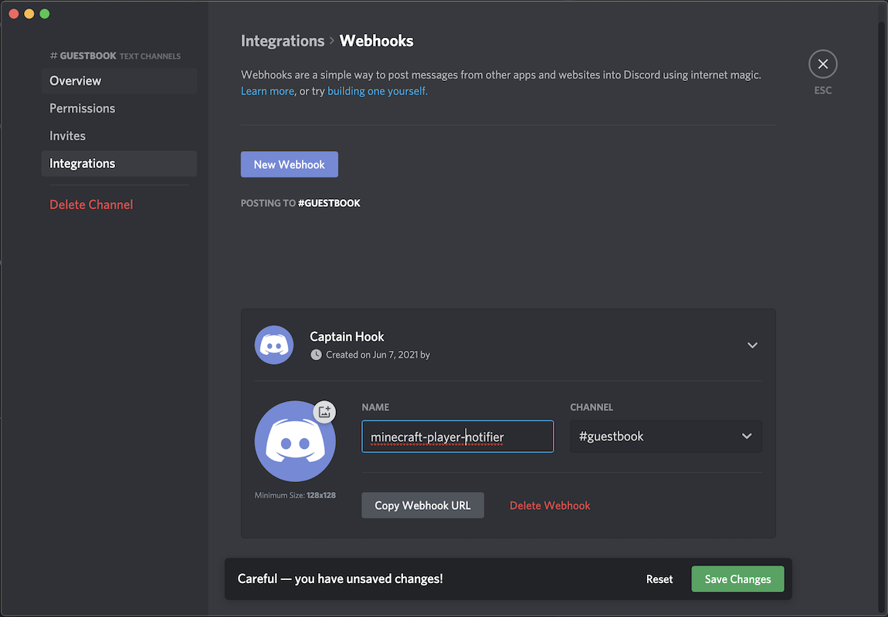

# minecraft-plugin-player-notification
A Minecraft Spigot/Bukkit/Paper server plugin that sends notifications when players join/leave the server.

Download and install this plugin from CurseForge [here](https://www.curseforge.com/minecraft/mc-mods/simple-discord-leave-join-notification).

Currently supported notifications:
1. Discord

# What problem does this solve?
My family plays together on a minecraft server. This plugin helps us know when others are playing so we can join, like this:



# Local Development

### Testing a local build
Requires Docker and Maven to be installed on your system.

After making changes to the plugin, run the following chained build, copy, and server start command:
```
mvn package && mkdir -p localdev/data/plugins && cp -v target/minecraft-plugin-join-notification-1.0-SNAPSHOT.jar $(pwd)/localdev/data/plugins && docker run --rm -e EULA=true  -p 25565:25565 -v localdev/data:/data cmunroe/spigot:1.16.4
```

You should see the following in the server logs as it boots up:

```
[03:36:19] [Server thread/INFO]: [PlayerNotificationPlugin] Enabling PlayerNotificationPlugin v1.0
```


Then start the minecraft client and connect to ``127.0.0.1:25565``


# Configuration
Run your minecraft Spigot or Bukkit server once with the PlayerNotificationPlugin installed. 
After it runs for the first time it will create the directory structure:

```
plugins/
    PlayerNotificationPlugin/
        config.yml
```

Open up ``config.yml`` and edit, replacing WEBHOOK-URL-GOES-HERE with the webhook URL configured in Discord:

```
notifiers:
  -
    type: "webhook"
    url: "WEBHOOK-URL-GOES-HERE"
    leaveFormat: "%s left!"
    joinFormat: "%s joined!"
```


# Discord Webhook Setup
Visit the [official Discord documentation](https://support.discord.com/hc/en-us/articles/228383668-Intro-to-Webhooks) on webhooks for instructions on how to create a webhook.

As of this writing, you use Edit Channel > Integrations > Webhooks

